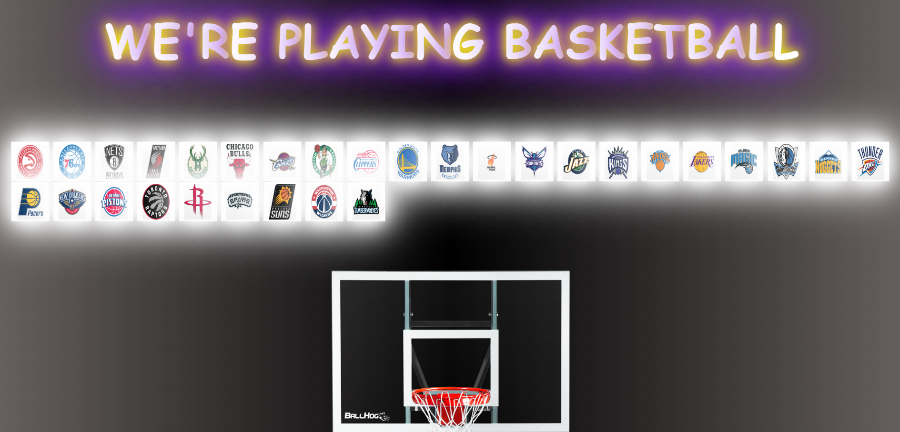
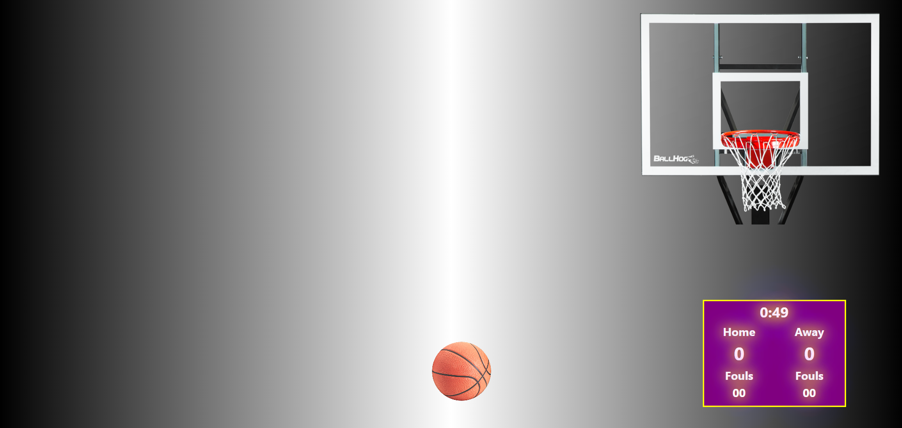

# NBA JavaScript Game

<h3><---------- Laptop Only ----------></h3>

<h1>Installation</h1>
    

With creating this application, two groupmates first created a mySql database from scratch. This database contained the five starting players from each team in the National Baskbetball Association. One other groupmate worked on creating the homepage (frontend and backend), while another worked on the baskbetball game (frontend and backend). These two pages are created with HTML, CSS, BootStrap, and JavaScript (jQuery). 

<h1>Usage</h1>

The purpose of this application is for users who want to play with their favorite players on their team. Or for users who just want to relax and play some games.The first page will show a roster of teams. Pick five players from any team. Once five players are picked, you will be directed to a game where you try to do as many free throws as you can. What you will see in this application is an unfinished product of the application. There is till more work that needs to be done.

<h1>Credits</h1>
<ul>
    <li>www.youtube.com</li>
    <li>www.github.com</li>
    <li>www.gitlab.com</li>
    <li>www.google.com</li>
    <li>www.stackoverflow.com</li>
    <li>Visual Studio Code</li>
    <li>RapidApi</li>
</ul>

